# Agile Sensing Kit (ASK)

**ASK** is an AI-powered agile development framework featuring specialized agents that replicate agile ceremonies, using **Beads** for persistent memory and task tracking across sessions.

> **What makes ASK different:** Traditional AI agents lose context between sessions. ASK agents use Beads' graph-based issue tracker to maintain memory, track dependencies, and coordinate work—like a team with shared institutional knowledge.

https://github.com/user-attachments/assets/7c9795b9-3aa8-45ea-b1b6-eacec52a740c

## 🎯 Overview

ASK provides **agile ceremony agents** with persistent memory:

| Capability | Description |
|------------|-------------|
| **Agile Ceremonies** | Sprint planning, retrospectives, story creation, code review |
| **Persistent Memory** | Beads graph-based issue tracker for cross-session context |
| **Agent Personas** | Named agents (John, Amelia, Winston, Murat) with distinct communication styles |
| **TDD Discipline** | Strictly enforced red-green-refactor cycle |
| **Azure Deployment** | Full IaC with azd, Bicep, GitHub Actions |

### Two Workflows

- **Greenfield (Build New)**: Transform product ideas into deployed applications through structured specification-driven development
- **Brownfield (Document Existing + Modernize)**: Reverse engineer existing codebases into comprehensive product and technical documentation

Both workflows use Beads for memory persistence and specialized agents working together.

### 🎉 Party Mode — Multi-Agent Brainstorming

ASK's standout feature: **Party Mode** brings all agents together for dynamic group discussions.

**Activate in VS Code Copilot Chat:**
```
@ask Party Mode
```

**What happens:**
- All 10 specialized agents join the conversation
- Each responds in character with their unique perspective
- PM asks "WHY?", Architect champions boring technology, Dev references file paths, TEA calculates risks
- Natural cross-talk and debates between agents
- Thread-based discussion with Agent Mail for persistent history

**Use Party Mode for:**
- Brainstorming new features
- Architecture decisions
- Code review discussions
- Sprint planning debates
- Any complex decision needing multiple perspectives

## 📋 Prerequisites

| Tool | Required For |
|------|--------------|
| **VS Code** | [Download](https://code.visualstudio.com/) - or use GitHub Codespaces (no install needed) |
| **GitHub Copilot** | VS Code Extension marketplace |

## 🚀 Quick Start

### Option 1: GitHub Codespaces (Recommended - Zero Setup)

1. Click **"Use this template"** → **"Create a new repository"**
2. Name your project and click **"Create repository"**
3. Click **"Code"** → **"Codespaces"** → **"Create codespace on main"**
4. In terminal, run:
   ```bash
   curl -fsSL https://raw.githubusercontent.com/tidoemanuele/agile-sensing-kit/main/scripts/setup.sh | bash
   ```
5. In **Copilot Chat** (right sidebar), start building:
   ```
   @ask Party Mode      # Brainstorm with all 10 agents
   @pm /prd                    # Create Product Requirements
   @dev /plan                  # Create technical tasks
   ```

**Brownfield (Existing Codebase)?** After step 4, copy your code into the repo, then:
- `@tech-analyst /rev-eng` to document your codebase
- `@modernizer /modernize` (optional) for modernization plan

### Option 2: Install Into Existing Project (Quick Install)

Transform any existing project into an ASK-enabled development environment:

**One-Line Install** (Recommended):
```bash
curl -fsSL https://raw.githubusercontent.com/tidoemanuele/agile-sensing-kit/main/scripts/quick-install.sh | bash
```

**Manual Install**:
```bash
# Clone and copy to your project
git clone https://github.com/tidoemanuele/agile-sensing-kit.git /tmp/ask
cp -r /tmp/ask/.github /tmp/ask/.ask /tmp/ask/.vscode your-project/
rm -rf /tmp/ask

# Or run the installer script
./scripts/install.sh --full                    # Linux/Mac
.\scripts\install.ps1 -Full                    # Windows

# Start using workflows
code .
# Use @pm, @dev, @azure agents and /prd, /frd, /plan, /deploy prompts
```

**What Gets Installed**:
- ✅ 10 specialized AI agents (Orchestrator, PM, Dev Lead, Dev, Azure, Rev-Eng, Modernizer, Planner, Architect, Test Engineer)
- ✅ 11 workflow prompts (/prd, /frd, /plan, /implement, /delegate, /deploy, /rev-eng, /modernize, /adr, /architect, /generate-agents)
- ✅ `.ask/` folder with workflows, knowledge base, and templates
- ✅ MCP server configuration (optional)
- ✅ Dev container setup (optional)
- ✅ APM configuration (optional)
- ✅ Getting Started tutorial and documentation

See **[INTEGRATION.md](INTEGRATION.md)** for detailed installation options and troubleshooting.


## 🏗️ Architecture

### Memory System (Beads)

ASK uses **Beads** as the persistent memory layer for all agents:

```
.beads/
├── issues.jsonl      # Git-committed source of truth
├── beads.db          # SQLite cache (gitignored)
└── config.yaml       # Beads configuration
```

**Key Capabilities:**
- **Graph-based task tracking** with 4 dependency types (blocks, related, parent-child, discovered-from)
- **Cross-session memory** - agents reconstruct context from previous sessions
- **Git-backed sync** - no server needed, works with distributed teams
- **CLI access** via `bd` command

**Common Commands:**
```bash
bd ready              # Show tasks ready to work on
bd create "Task"      # Create new issue
bd show <id>          # View issue details
bd dep tree <id>      # Visualize dependencies
bd close <id>         # Complete an issue
```

### Development Environment

The `.devcontainer/` folder provides a **ready-to-use development container** with:
- Python 3.12
- Azure CLI & Azure Developer CLI (azd)
- TypeScript
- Docker-in-Docker
- VS Code extensions: GitHub Copilot Chat, Azure Pack, AI Studio

### MCP Servers

The `.vscode/mcp.json` configures **Model Context Protocol servers** that give agents access to:
- **context7** - Up-to-date library documentation
- **github** - Repository management and operations
- **microsoft.docs.mcp** - Official Microsoft/Azure documentation
- **playwright** - Browser automation capabilities
- **deepwiki** - Repository context and understanding for external repos
- **agent-mail** - Agent-to-agent communication (see below)

### Agent Communication (Mail MCP)

ASK agents communicate via [mcp_agent_mail](https://github.com/Dicklesworthstone/mcp_agent_mail) - a Git-backed mailbox system for agent coordination.

**Setup:**
```bash
# One-line install
curl -fsSL "https://raw.githubusercontent.com/Dicklesworthstone/mcp_agent_mail/main/scripts/install.sh" | bash -s -- --yes

# Start server (creates `am` alias)
am
```

**Agent Registration Workflow:**

Each agent registers at session start using `macro_start_session`:
```
1. ensure_project(human_key="/path/to/project")  → Creates/finds project
2. register_agent(name="BlueLake", program="claude-code", model="opus-4.5")  → Creates identity
3. fetch_inbox(agent_name="BlueLake")  → Gets pending messages
```

**Agent Communication:**
```
send_message(to=["GreenCastle"], subject="Review needed", body_md="Please review auth module")
reply_message(message_id=123, body_md="LGTM, approved")
fetch_inbox(agent_name="BlueLake", urgent_only=true)
```

**File Reservations (Prevent Conflicts):**
```
file_reservation_paths(paths=["src/auth/*.ts"], exclusive=true)  → Lock files while editing
release_file_reservations()  → Release when done
```

**Web Dashboard:** http://127.0.0.1:8765/mail

### AI Agents

Ten specialized agents in `.github/agents/`:

#### 0. **ASK Agent** (`@ask`) - Orchestrator
- **Model**: Claude Sonnet 4.5
- **Tools**: All tools, runSubagent
- **Purpose**: Main entry point that routes requests to specialized agents
- **Instructions**: Analyzes user intent, delegates to appropriate agents, coordinates multi-agent workflows

#### 1. **PM Agent** (`@pm`) - Product Manager
- **Model**: o3-mini
- **Tools**: Edit files, search, fetch web content
- **Purpose**: Translates ideas into structured PRDs and FRDs
- **Instructions**: Asks clarifying questions, identifies business goals, creates living documentation

#### 2. **Dev Lead Agent** (`@dev-lead`) - Technical Lead
- **Model**: Claude Sonnet 4
- **Tools**: Read files, search, semantic analysis  
- **Purpose**: Reviews architecture, provides technical guidance, ensures adherence to `AGENTS.md`
- **Instructions**: Analyzes engineering patterns, reviews technical decisions, validates against standards
- **Note**: AGENTS.md is auto-generated by `apm compile`

#### 3. **Dev Agent** (`@dev`) - Developer
- **Model**: Claude Sonnet 4
- **Tools**: Full development suite + Context7, GitHub, Microsoft Docs, Copilot Coding Agent, AI Toolkit
- **Purpose**: Breaks down features into tasks, implements code, or delegates to GitHub Copilot
- **Instructions**: Analyzes specs, writes modular code, follows architectural patterns, creates GitHub issues

#### 4. **Azure Agent** (`@azure`) - Cloud Architect
- **Model**: Claude Sonnet 4
- **Tools**: Azure resource management, Bicep, deployment tools, infrastructure best practices
- **Purpose**: Deploys applications to Azure with IaC and CI/CD pipelines
- **Instructions**: Analyzes codebase, generates Bicep templates, creates GitHub Actions, uses Azure Dev CLI


#### 5. **Reverse Engineering Tech Analyst Agent** (`@tech-analyst`) - Technical Analyst
- **Model**: Claude Sonnet 4
- **Tools**: Code analysis, documentation generation, specification extraction
- **Purpose**: Reverse engineers existing codebases into specifications and documentation
- **Instructions**: Analyzes codebase, generates technical tasks, creates feature requirements, synthesizes product vision


#### 6. **Modernization Agent** (`@modernizer`) - Modernization Specialist
- **Model**: Claude Sonnet 4.5
- **Tools**: Code analysis, modernization planning, risk assessment
- **Purpose**: Analyzes existing codebases for modernization opportunities and creates implementation plans
- **Instructions**: Assesses technical debt, crafts modernization strategies, develops risk management plans

#### 7. **Planner Agent** (`@planner`) - Task Planner
- **Model**: Claude Sonnet 4.5
- **Tools**: Edit, search, Mermaid diagrams
- **Purpose**: Creates comprehensive implementation plans from requirements
- **Instructions**: Breaks down features into tasks, creates multi-level diagrams (L0-L3), identifies dependencies

#### 8. **Architect Agent** (`@architect`) - System Architect
- **Model**: Claude Sonnet 4.5
- **Tools**: All tools, research capabilities
- **Purpose**: Makes and documents architecture decisions
- **Instructions**: Creates ADRs, generates AGENTS.md, documents system architecture

#### 9. **Test Engineer Agent** (`@tea`) - Test Engineer
- **Model**: Claude Sonnet 4.5
- **Tools**: Code analysis, test tools
- **Purpose**: Reviews code quality and test coverage
- **Instructions**: Validates TDD compliance, reviews test quality, ensures coverage requirements

## 📋 Workflows

### Greenfield Workflow (Forward: Idea → Code)

```mermaid
graph TB
    Start[("👤 User<br/>High-level app idea")]

    Start --> Party["<b>@ask Party Mode</b><br/>🎉 All 10 agents brainstorm<br/>Refine idea collaboratively"]

    Party --> PRD["<b>/prd</b><br/>📝 PM Agent creates<br/>Product Requirements Document"]

    PRD --> FRD["<b>/frd</b><br/>📋 PM Agent breaks down<br/>Feature Requirements Documents"]

    FRD --> GenAgents["<b>/generate-agents</b><br/>📦 Dev Lead reads standards<br/>Generates AGENTS.md"]

    GenAgents --> Plan["<b>/plan</b><br/>🔧 Dev Agent creates<br/>Technical Task Breakdown"]

    Plan --> Choice{"Implementation<br/>Choice"}

    Choice -->|Local| Implement["<b>/implement</b><br/>💻 Dev Agent<br/>implements code locally"]

    Choice -->|Delegated| Delegate["<b>/delegate</b><br/>🎯 Dev Agent creates<br/>GitHub Issue + assigns<br/>Copilot Coding Agent"]

    Implement --> Deploy["<b>/deploy</b><br/>☁️ Azure Agent<br/>creates IaC + deploys to Azure"]

    Delegate --> Deploy

    Deploy --> Done[("✅ Production-Ready<br/>Application on Azure")]

    style Start fill:#e1f5ff
    style Party fill:#ffe4ec
    style PRD fill:#fff4e6
    style FRD fill:#fff4e6
    style GenAgents fill:#e3f2fd
    style Plan fill:#e8f5e9
    style Implement fill:#e8f5e9
    style Delegate fill:#e8f5e9
    style Deploy fill:#f3e5f5
    style Done fill:#e1f5ff
    style Choice fill:#fff9c4
```



### Brownfield Workflow (Reverse: Code → Documentation)

```mermaid
graph TB
    StartBrown[("📦 Existing Codebase<br/>Undocumented or<br/>poorly documented")]
    
    StartBrown --> Rev-Eng["<b>/rev-eng</b><br/>📋 Reverse Engineering Agent Analyses code<br/>& documents technical tasks"]
    
    Rev-Eng --> Modernize["<b>/modernize</b><br/>(Optional)<br/>💻 Modernization Agent Documents<br/>& documents modernization tasks"]
    
    Modernize --> Plan["<b>/plan</b><br/>(Optional)<br/>💻 Developer Agent Implements<br/>Modernization tasks"]
    
    Plan --> Deploy["<b>/deploy</b><br/>(Optional)<br/>☁️ Azure Agent<br/>creates IaC + deploys to Azure"]

    Deploy --> Done[("✅ Modernized(optional) and documented<br/>Application on Azure")]

    Rev-Eng --> Done
        
    style StartBrown fill:#ffe0b2
    style Rev-Eng fill:#e8f5e9
    style Modernize fill:#e8f5e9
    style Plan fill:#e8f5e9
    style Deploy fill:#f3e5f5
    style Done fill:#e1f5ff
```



### Greenfield Workflow Steps (Forward)

1. **`/prd`** - Product Requirements Document
   - PM Agent engages in conversation to understand the product vision
   - Creates `specs/prd.md` with goals, scope, requirements, and user stories
   - Living document that evolves with feedback

2. **`/frd`** - Feature Requirements Documents
   - PM Agent decomposes the PRD into individual features
   - Creates files in `specs/features/` for each feature
   - Defines inputs, outputs, dependencies, and acceptance criteria

3. **`/generate-agents`** - Generate Agent Guidelines (Optional)
   - Dev Lead Agent reads all standards from `standards/` directory
   - Consolidates engineering standards into comprehensive `AGENTS.md`
   - Can be run at project start or deferred until before `/plan` and `/implement`
   - **Must be completed before planning and implementation begins**

4. **`/plan`** - Technical Planning
   - Dev Agent analyzes FRDs and creates technical task breakdowns
   - Creates files in `specs/tasks/` with implementation details
   - Identifies dependencies, estimates complexity, defines scaffolding needs

5. **`/implement`** OR **`/delegate`** - Implementation
   - **Option A (`/implement`)**: Dev Agent writes code directly in `src/backend` and `src/frontend`
   - **Option B (`/delegate`)**: Dev Agent creates GitHub Issues with full task descriptions and assigns to GitHub Copilot Coding Agent
   
6. **`/deploy`** - Azure Deployment
   - Azure Agent analyzes the codebase
   - Generates Bicep IaC templates
   - Creates GitHub Actions workflows for CI/CD
   - Deploys to Azure using Azure Dev CLI and MCP tools

### Brownfield Workflow Steps (Reverse)


1. **`/rev-eng`** - Reverse Engineer Codebase
   - Reverse Engineering Agent analyzes existing codebase
   - Creates technical tasks, feature requirements, and product vision documents
   - Follows strict rules to ensure accuracy and honesty about existing functionality
   - **Critical Rules**:
     - ⚠️ **NEVER modifies code** - Read-only analysis
     - ⚠️ **Documents ONLY what exists** - No fabrication
     - ⚠️ **Honest about gaps** - Notes missing tests, incomplete features
     - Links each task to actual code files and implementations

2. **`/modernize`** - Create Modernization Plan (Optional)
   - Modernization Agent assesses existing codebase for modernization opportunities
   - Creates files in `specs/modernize/` with modernization analysis 
   - Creates files in `specs/tasks/` with specific modernization tasks
   - Develops risk assessment and mitigation strategies
   - **Critical Rules**:
     - ⚠️ **NEVER modifies code** - Read-only analysis
     - ⚠️ **Evidence-based** - Recommendations based on actual code quality
     - ⚠️ **Honest about feasibility** - Notes technical debt and potential risks

3. **`/plan`** - Implement Modernization Tasks (Optional)
   - Dev Agent reads modernization tasks from `specs/tasks/`
   - Implements modernization tasks in the codebase
   - Follows best practices and architectural patterns

4. **`/deploy`** - Azure Deployment (Optional)
   - Azure Agent deploys the modernized application to Azure
   - Generates updated Bicep IaC templates and CI/CD workflows
   - Uses Azure Dev CLI and MCP tools for deployment

### Why Use Brownfield Workflow?

- **Onboard new team members** - Comprehensive documentation of existing systems
- **Legacy system understanding** - Reverse engineer undocumented codebases
- **Pre-acquisition due diligence** - Document technical assets before purchase
- **Migration planning** - Understand current state before modernization
- **Audit and compliance** - Document what the system actually does
- **Knowledge preservation** - Capture tribal knowledge before team changes
- **Bridge to modernization** - After documenting, use greenfield workflow to add features

## 📁 Documentation Structure

The workflow creates living documentation:

```
specs/
├── prd.md              # Product Requirements Document
├── features/           # Feature Requirements Documents
│   ├── feature-1.md
│   └── feature-2.md
├── tasks/              # Technical Task Specifications
│   ├── task-1.md
│   ├── task-2.md
│   ├── modernization/          # Modernization-specific tasks
│   │   ├── dependency-upgrade-*.md # Dependency update tasks
│   │   ├── architecture-refactor-*.md # Architecture improvement tasks
│   │   ├── security-remediation-*.md # Security fix tasks
│   │   └── performance-optimization-*.md # Performance improvement tasks
│   └── testing/                # Testing and validation tasks
│       ├── regression-test-*.md # Regression testing tasks
│       ├── feature-validation-*.md # Feature continuity validation
│       ├── performance-benchmark-*.md # Performance testing tasks
│       └── integration-test-*.md # Integration testing tasks
├── modernize/                    # Modernization strategy and plans
│   ├── assessment/              # Analysis and assessment reports
│   │   ├── technical-debt.md    # Technical debt analysis
│   │   ├── security-audit.md    # Security vulnerabilities and gaps
│   │   ├── performance-analysis.md # Performance bottlenecks and issues
│   │   ├── architecture-review.md # Architecture assessment
│   │   └── compliance-gaps.md   # Compliance and standards gaps
│   ├── strategy/                # Modernization strategies
│   │   ├── roadmap.md          # Overall modernization roadmap
│   │   ├── technology-upgrade.md # Technology modernization plan
│   │   ├── architecture-evolution.md # Architecture improvement plan
│   │   ├── security-enhancement.md # Security modernization strategy
│   │   └── devops-transformation.md # DevOps and operational improvements
│   ├── plans/                   # Detailed implementation plans
│   │   ├── migration-plan.md    # Step-by-step migration approach
│   │   ├── testing-strategy.md  # Comprehensive testing approach
│   │   ├── rollback-procedures.md # Rollback and contingency plans
│   │   └── validation-criteria.md # Success criteria and validation
│   └── risk-management/         # Risk assessment and mitigation
│       ├── risk-analysis.md     # Risk identification and assessment
│       ├── mitigation-strategies.md # Risk mitigation approaches
│       └── contingency-plans.md # Emergency procedures and fallbacks
└── docs/                 # Technical Documentation
    ├── architecture/     # Architecture documentation
    │   ├── overview.md   # System overview and context
    │   ├── components.md # Component architecture
    │   └── patterns.md   # Design patterns and conventions
    ├── technology/       # Technology stack documentation
    │   ├── stack.md      # Complete technology inventory
    │   ├── dependencies.md # Dependencies and versions
    │   └── tools.md      # Development and build tools
    ├── infrastructure/   # Infrastructure and deployment
    │   ├── deployment.md # Deployment architecture
    │   ├── environments.md # Environment configuration
    │   └── operations.md # Operational procedures
    └── integration/      # External integrations
        ├── apis.md       # External API integrations
        ├── databases.md  # Database schemas and models
        └── services.md   # External service dependencies
src/
├── backend/            # Backend implementation
└── frontend/           # Frontend implementation

apm_modules/            # APM packages (engineering standards)
├── azure-standards/    # General Azure & engineering standards
├── python-backend/     # Python backend standards (optional)
└── react-frontend/     # React frontend standards (optional)

AGENTS.md               # Root guidelines (generated by apm compile)
apm.yml                 # APM package manifest
mkdocs.yml              # MKdocs configuration for documentation site
docs/                   # MKdocs documentation source files
```

### Documentation with MKdocs

This repository is configured with **MKdocs** for generating beautiful project documentation:

- **Configuration**: `mkdocs.yml` contains site settings and navigation
- **Source Files**: Documentation markdown files in `docs/` directory
- **Standards**: Documentation practices defined in `standards/general/documentation-guidelines.md`
- **Build & Serve**: Use MKdocs commands to preview and deploy documentation

The documentation standards ensure consistency, accessibility, and maintainability across all project documentation.

## 📦 Managing Standards with APM

This repository uses **[APM (Agent Package Manager)](https://github.com/danielmeppiel/apm)** for managing engineering standards. APM provides:

- ✅ **Zero-config setup** - `apm install` reads `apm.yml` and installs all dependencies
- ✅ **Semantic versioning** - Lock to specific versions or use latest
- ✅ **Automatic AGENTS.md** - `apm compile` generates guardrails from all packages
- ✅ **Mix any standards** - Combine Microsoft, community, and custom packages
- ✅ **One-command updates** - `apm update` to get latest standards

### Built-in Standards

By default, ASK includes:
- **azure-standards** - General engineering, documentation, agent-first patterns, CI/CD, security

### Adding More Standards

Edit `apm.yml` to add technology-specific standards:

```yaml
dependencies:
  apm:
    - EmeaAppGbb/azure-standards@1.0.0
    - EmeaAppGbb/python-backend@1.0.0  # Add Python backend rules
    - EmeaAppGbb/react-frontend@1.0.0  # Add React frontend rules
```

Then run:

```bash
apm install  # Install new packages
apm compile  # Regenerate AGENTS.md with new standards
```

### Creating Custom Standards

Create your own APM package:

```bash
my-standards/
├── apm.yml
├── README.md
└── .apm/
    └── instructions/
        ├── api-design.instructions.md
        ├── database-patterns.instructions.md
        └── security-rules.instructions.md
```

Install from any GitHub repo:

```bash
# Public repo
apm install your-org/your-standards

# Private repo (requires GITHUB_APM_PAT)
export GITHUB_APM_PAT=your_token
apm install your-org/private-standards
```

### Updating Standards

```bash
# Update all packages to latest
apm update

# Update specific package
apm update danielmeppiel/azure-standards

# Regenerate AGENTS.md after updates
apm compile
```

## 🎓 Example Usage

### Greenfield Example (New Project)

```bash
# Start with your product idea
"I want to create a smart AI agent for elderly care that tracks vitals and alerts caregivers"

# Step 1: Create the PRD
/prd

# Step 2: Break down into features
/frd

# Step 3: Generate agent guidelines from standards (optional, can defer)
/generate-agents

# Step 4: Create technical plans
/plan

# Step 5a: Implement locally
/implement

# OR Step 5b: Delegate to GitHub Copilot
/delegate

# Step 6: Deploy to Azure
/deploy
```

### Brownfield Example (Existing Project)

```bash
# You have an existing codebase with minimal or outdated documentation
"I inherited a marketing campaign management app built in Python/React"

# Step 1: Reverse engineer technical tasks from code
/plan-brown
# Agent analyzes codebase (Python FastAPI backend, React frontend)
# Creates specs/tasks/ with honest documentation of what exists
# Notes: "Task 008: Email service - stub only, not fully implemented"

# Step 2: Synthesize feature requirements from tasks
/frd-brown
# Agent groups tasks into product features
# Creates specs/features/campaign-management.md, user-authentication.md, etc.
# Notes: "Email notifications feature - partially implemented"

# Step 3: Create product vision from features
/prd-brown
# Agent synthesizes overall product purpose
# Creates specs/prd.md with goals, scope, user stories
# Includes "Product Status Assessment" with gaps and recommendations

# Result: Complete documentation traceability
# PRD → FRDs → Tasks → Code (with file paths)

# Optional: Now enhance using greenfield workflow
/frd  # Add new features to existing FRDs
/plan # Create tasks for new features
/implement # Build the enhancements
```

## 🔑 Key Benefits

### Greenfield Benefits
- **Zero Setup** - Dev container has everything preconfigured
- **Structured Process** - Clear workflow from idea to production
- **AI-Powered** - Specialized agents handle different aspects
- **Best Practices** - Built-in architedtural guidance via `AGENTS.md` 
- **Flexible Standards** - Choose local development or delegation
- **Composable** - Add only the standards you need (Python, React, .NET, etc.)
- **Versioned** - Lock to specific standard versions or use latest
- **Azure-Ready** - Automated IaC and CI/CD generation

### Brownfield Benefits
- **Comprehensive Documentation** - Reverse engineer complete product docs from code
- **Full Traceability** - Every product requirement links to code implementation
- **Honest Assessment** - Identifies gaps, missing tests, incomplete features
- **Technology Agnostic** - Works with any language/framework (.NET, Python, Node.js, Java, etc.)
- **Knowledge Capture** - Preserves understanding before team changes
- **Bridge to Modernization** - Document current state, then enhance with greenfield workflow
- **Onboarding Accelerator** - New developers understand system architecture quickly

### Universal Benefits
- **Living Documentation** - Specs evolve with the codebase
- **Bidirectional Workflow** - Start with idea OR start with code
- **Specialized Agents** - PM, Dev, Dev Lead, and Azure agents with distinct roles
- **Evidence-Based** - Brownfield never fabricates, greenfield builds intentionally

## 📖 Learn More

- See `AGENTS.md` for comprehensive engineering guidelines
- Explore `.github/chatmodes/` for agent configurations
- Review `.github/prompts/` for prompt templates

## 🤝 Contributing

Contributions welcome! Extend with additional agents, prompts, or MCP servers.

---

**From idea to production in minutes, not months.** 🚀
# agile-sensing-kit
